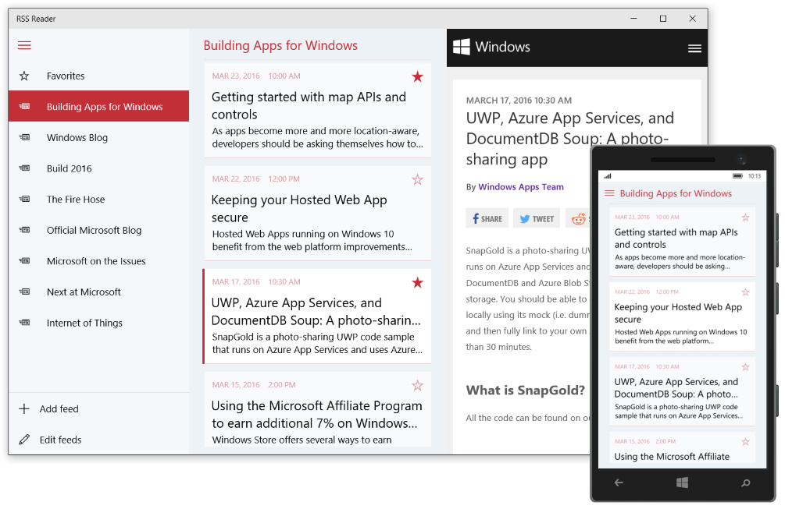

# RssReader sample

**RssReader** is a sample Universal Windows Platform (UWP) app for retrieving RSS feeds and viewing articles. 
Users can specify the URL of a feed, launch articles for viewing in the browser, and save favorite articles to 
local storage. It is designed to run on multiple form factors and uses an MVVM architecture.  

## Features

**Note:** Features in this app are subject to change.

RssReader demonstrates:
	
* The navigation menu (hamburger menu) pattern and screen-width adaptivity using the 
  [SplitView](https://msdn.microsoft.com/library/windows/apps/windows.ui.xaml.controls.splitview.aspx) control and the 
  [AdaptiveTrigger](https://msdn.microsoft.com/library/windows/apps/windows.ui.xaml.adaptivetrigger.aspx) class.
* The Syndication APIs ([Windows.Web.Syndication](https://msdn.microsoft.com/library/windows/apps/windows.web.syndication.aspx)) 
  to retrieve RSS feed data. 
* The [DataContractSerializer](https://msdn.microsoft.com/library/windows/apps/system.runtime.serialization.datacontractserializer.aspx) class to save and 
restore app data from local storage.
* C# and XAML using the MVVM design pattern.

### March 2016 update

This update includes:

* A complete redesign of the UI to show effective use of color, type, images, and animated effects.
* Major improvements to layout, navigation, and window-size adaptivity to support small and large screens. 
* Use of the [WebView](https://msdn.microsoft.com/library/windows/apps/windows.ui.xaml.controls.webview.aspx) 
  control to show articles within the app. 
* The ability to rename feeds and to rearrange feeds and favorites. 

We implemented the navigation and layout patterns in this sample using code from the 
[XAML navigation menu](https://github.com/Microsoft/Windows-universal-samples/tree/master/Samples/XamlNavigation) and
[XAML master/detail](https://github.com/Microsoft/Windows-universal-samples/tree/master/Samples/XamlMasterDetail) samples in the 
[Windows-universal-samples](https://github.com/Microsoft/Windows-universal-samples) repo. These samples represent the current
minimum recommendations for these patterns, and the RssReader sample will continue to reflect this guidance in future updates. 

**Note:** This UI redesign is a work in progress. The goal for the current release is to provide a working baseline of the 
UI features listed above. There are a few known issues with window-size adaptivity that we will fix soon. 
Other updates in planning for the near future include refactoring the implementation to increase 
the use of adaptive triggers, visual state manager, relative layout panels, and other XAML recommendations. 

Please report any bugs or suggestions on the [Issues](https://github.com/Microsoft/Windows-appsample-rssreader/issues) list. 
All feedback is welcome!

## Code at a glance

If you're just interested in code snippets for certain API and don't want to browse or run the full sample, 
check out the following files for examples of some highlighted features:

* [FeedView.xaml](Views/FeedView.xaml#L25), [AddFeedView.xaml](Views/AddFeedview.xaml#L25), 
  [EditFeedsView.xaml](Views/EditFeedsView.xaml#L25), and [Styles.xaml](Styles/Styles.xaml#L25)
    - Rich UI experiences and XAML resources for colors, templates, and animated effects. 
* [AppShell.xaml](AppShell.xaml#L25) and [AppShell.xaml.cs](AppShell.xaml.cs#L25)
    - Use of the [SplitView](https://msdn.microsoft.com/library/windows/apps/windows.ui.xaml.controls.splitview.aspx) control 
      to implement a navigation menu with a hamburger button. 
    - Use of [AdaptiveTrigger](https://msdn.microsoft.com/library/windows/apps/windows.ui.xaml.adaptivetrigger.aspx) with
      [VisualState.Setters](https://msdn.microsoft.com/library/windows/apps/windows.ui.xaml.visualstate.setters.aspx) and 
      [VisualStateManager](https://msdn.microsoft.com/library/windows/apps/windows.ui.xaml.visualstatemanager.aspx) 
      to adjust the navigation menu depending on the current window width. 
    - Code that adjusts header margins depending on the state of the navigation menu and hamburger button. 
    - Keyboard support and Frame navigation.
* [MasterDetailPage.xaml](Views/MasterDetailPage.xaml#L25), [MasterDetailPage.xaml.cs](Views/MasterDetailPage.xaml.cs#L25),
  [DetailPage.xaml](Views/DetailPage.xaml#L25) and [DetailPage.xaml.cs](Views/DetailPage.xaml.cs#L25)
    - Code that adjusts the display of the articles list, the 
      [WebView](https://msdn.microsoft.com/library/windows/apps/windows.ui.xaml.controls.webview.aspx) showing article content, and 
      the title-bar back button depending on the current window width. 
* [FeedDataSource.cs](ViewModels/FeedDataSource.cs#L25) and [Serializer.cs](Common/Serializer.cs#L25)
    - Loading default feed data from the app package using [StorageFile.GetFileFromApplicationUriAsync](https://msdn.microsoft.com/library/windows/apps/windows.storage.storagefile.getfilefromapplicationuriasync.aspx).
    - Loading feed and article data from an RSS server using [SyndicationClient.RetrieveFeedAsync](https://msdn.microsoft.com/library/windows/apps/windows.web.syndication.syndicationclient.retrievefeedasync.aspx). 
    - Loading and saving feed and favorites data to/from local storage using [StorageFolder.TryGetItemAsync](https://msdn.microsoft.com/library/windows/apps/windows.storage.storagefolder.trygetitemasync.aspx),
      [StorageFolder.CreateFileAsync](https://msdn.microsoft.com/library/windows/apps/br227250.aspx), 
      and [DataContractSerializer](https://msdn.microsoft.com/library/windows/apps/system.runtime.serialization.datacontractserializer.aspx).

## Universal Windows Platform development

This sample requires Visual Studio 2015 and the Windows Software Development Kit (SDK) for Windows 10. 

[Get a free copy of Visual Studio 2015 Community Edition with support for building Universal Windows apps](http://go.microsoft.com/fwlink/?LinkID=280676)

Additionally, to be informed of the latest updates to Windows and the development tools, join the 
[Windows Insider Program](https://insider.windows.com/ "Become a Windows Insider").

## Running the sample

The default project is RssReader and you can Start Debugging (F5) or Start Without Debugging (Ctrl+F5) to try it out. 
The app will run in the emulator or on physical devices. 

**Note:** This sample assumes you have an internet connection. Also, the platform target currently defaults to ARM, 
so be sure to change that to x64 or x86 if you want to test on a non-ARM device. 

